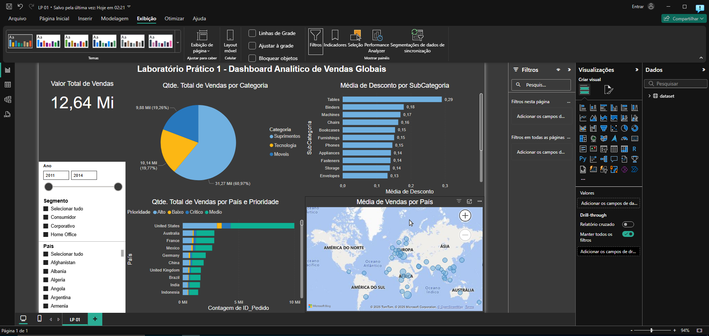

# Capítulo 02 - Primeiros Passos com o Power BI

## Laboratório Prático 1 - Dashboard Analítico de Vendas Globais

### Requisitos

- Perguntas:
1. Qual o valor total vendido?
2. Quantas vendas foram realizadas por categoria de produto?
3. Quantas vendas foram realizadas por país considerando a prioridade de entrega?
4. Qual foi a média de desconto nas vendas por subcategoria de produto?
5. Quais países tiveram maior média de valor de venda? Demonstre em um mapa.

- Observações:
-- E nosso Dashboard deve dar ao usuário a possibilidade de filtrar os dados por ano, por segmento e por país.

### Resultado

